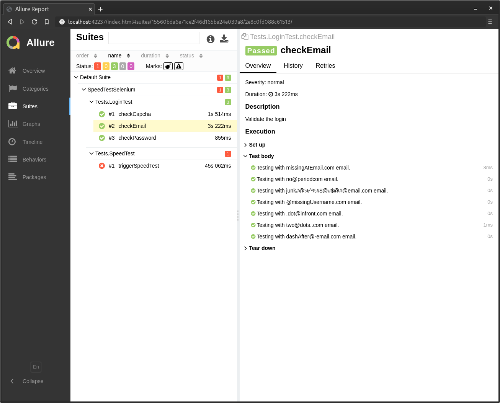

# SpeedTestSelenium

An example of Selenium Web Automation.

- Language: *Java*
- Build tool: *Maven*
- Framework: *TestNG*
- IDE: *IntelliJ IDEA* 
- OS: *Fedora 33*

## How to run

`cd {repo folder}`

`mvn clean install`

## How to generate report

Install Allure

`sudo npm i -g allure-commandline`

Generate report

`cd {repo folder}`

`allure serve -h localhost allure-report`

## Report screenshots

###### *NOTE: Don't bother about the IP from the screenshot. Test was run via VPN.* 😁 